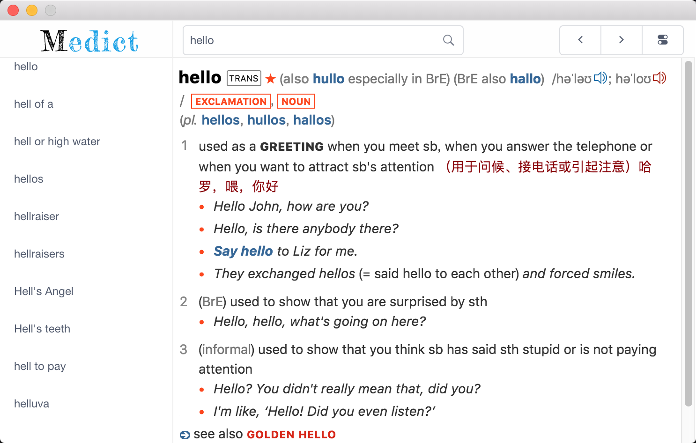
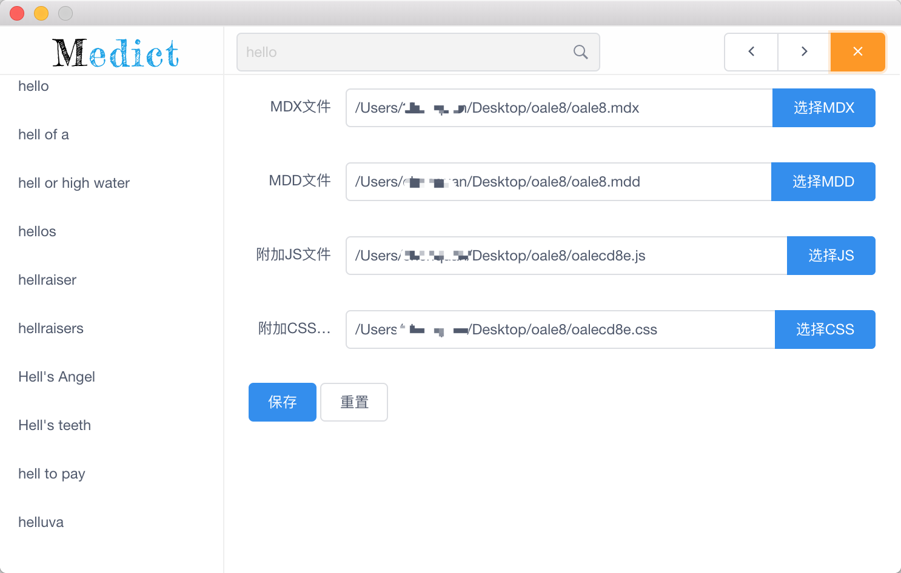

# medict
[](https://travis-ci.org/terasum/medict)
[](https://github.com/terasum/medict/releases)


> medict a cross platform dictionary application,support *.mdx/*.mdd dictionary format

## UI

**ui is under adjusting**





## Usage

you should select mdx/mdd file when you first run medict,
the app will reload automatically

## Build 

``` bash
$ git clone https://github.com/terasum/medict.git

$ cd medict
# install dependencies
yarn install

# serve with hot reload at localhost:9080
yarn run dev

# build electron application for production
yarn run build

```

**Medict is made by terasum with ❤️**