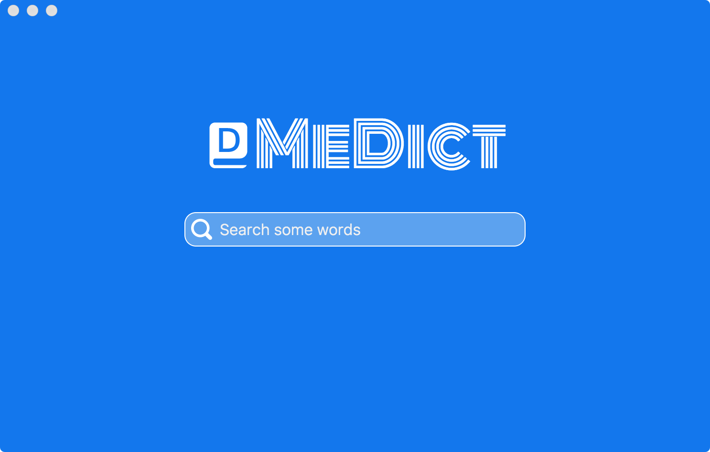

# medict
[](https://travis-ci.org/terasum/medict)
[](https://github.com/terasum/medict/releases)
[](https://github.com/terasum/medict/releases)


> medict a cross platform dictionary application,support *.mdx/*.mdd dictionary format

## UI




## Build 

``` bash
$ git clone https://github.com/terasum/medict.git

$ cd medict
# install dependencies
npm install

# serve with hot reload at localhost:9080
npm run dev

# build electron application for production
npm run build

# run unit & end-to-end tests
npm test

# lint all JS/Vue component files in `src/`
npm run lint

```

**Medict is made by terasum with ❤️**