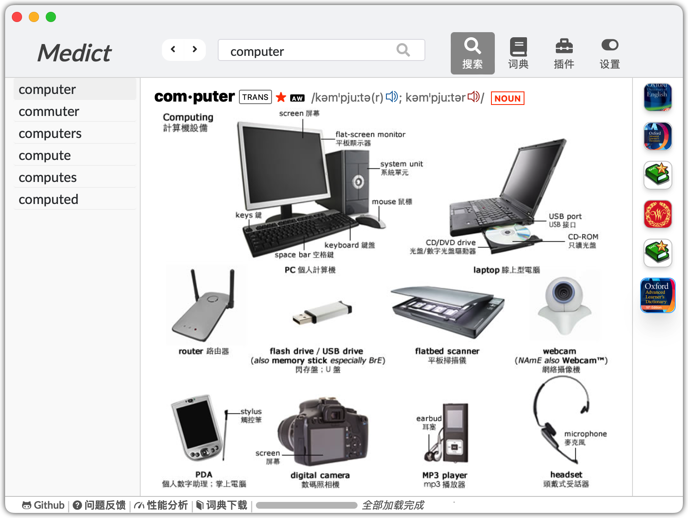
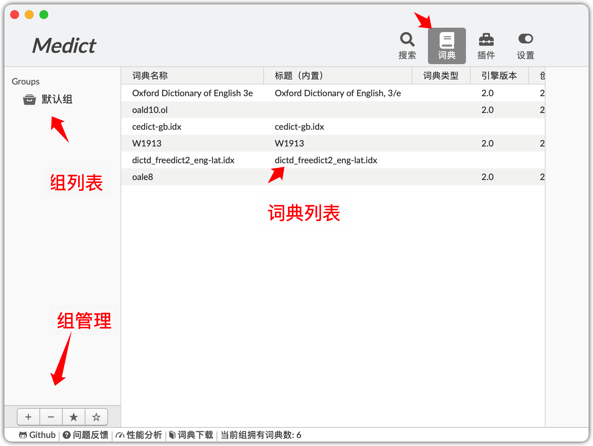

## Medict 介绍

Medict 是一个跨平台的词典 APP, 主要支持 \*.mdx/\*.mdd 词典格式, 目前支持 v1.x 和 v2.0 格式的词典。

## 使用说明

### 简介

Medict 是一个跨平台的词典 APP, 主要支持 *.mdx/*.mdd 词典格式, 目前支持 v1.x 和 v2.0 格式的词典。

### 下载安装

目前 Medict 正在紧张开发阶段，版本为自动打包滚动发布，请自行到 https://github.com/terasum/medict/releases 页面寻找最新开发版本, 所有版本均有打包日期，选择最新版本即可。

### 界面概览

软件目前包括 “搜索”，“词典”，“插件”，“设置” 四个界面，其中“插件”目前尚在开发当中。

### 词典安装

目前v3版本的Medict采用自动扫描词典的方式添加词典，您只需将词典放到词典扫描根目录即可，以下是各个操作系统的词典默认扫描根目录：

| 操作系统 | 默认词典目录                                              | 说明                                                         |
| -------- | --------------------------------------------------------- | ------------------------------------------------------------ |
| MacOS    | /Users/chenquan/Library/Application\ Support/medict/dicts | 您可以在Medict 的`设置`界面打开，也可打开Finder,按住 `Control+Shift+G`并输入该目录打开。 |
| Windows  | %APPDATA%/medict/dicts                                    |                                                              |
| Linux    | $HOME/.medict/dicts                                       |                                                              |

目前 Medict 采用的是目录词典组织方式，一个目录即为一个词典，内部可以放置mdict或stardict两种格式的词典，类似下图：

#### 特殊文件

在目录中可以放置一些特殊用途的文件，用于增强词典：

| 特殊文件名称               | 用途         | 说明                                                         |
| -------------------------- | ------------ | ------------------------------------------------------------ |
| cover.jpg或cover.png       | 词典封面图片 | 该文件针对stardict词典，若是mdict词典，也可提供与mdx同名的jpg或png文件 |
| mdict.dtype/stardict.dtype | 词典类型文件 | 后续用于支持其他词典类型（目前可自动识别）                   |
|                            |              |                                                              |

#### stardict

目前仅支持同时具备 (dict.dz或dict文件，ifo文件，idx文件)的词典，缺少文件的词典不支持。

### 查词功能

在搜索框输入所需的词即可查词，右侧边栏可以选择使用的词典：

### 词典界面

点击上方词典按钮，可进入词典功能，进行词典管理，目前仅支持查看，词典请通过操作系统文件浏览器管理（Finder等）

### 插件管理

**tobe done**

### 词典设置

点击上方设置按钮，可进入词典设置功能。

