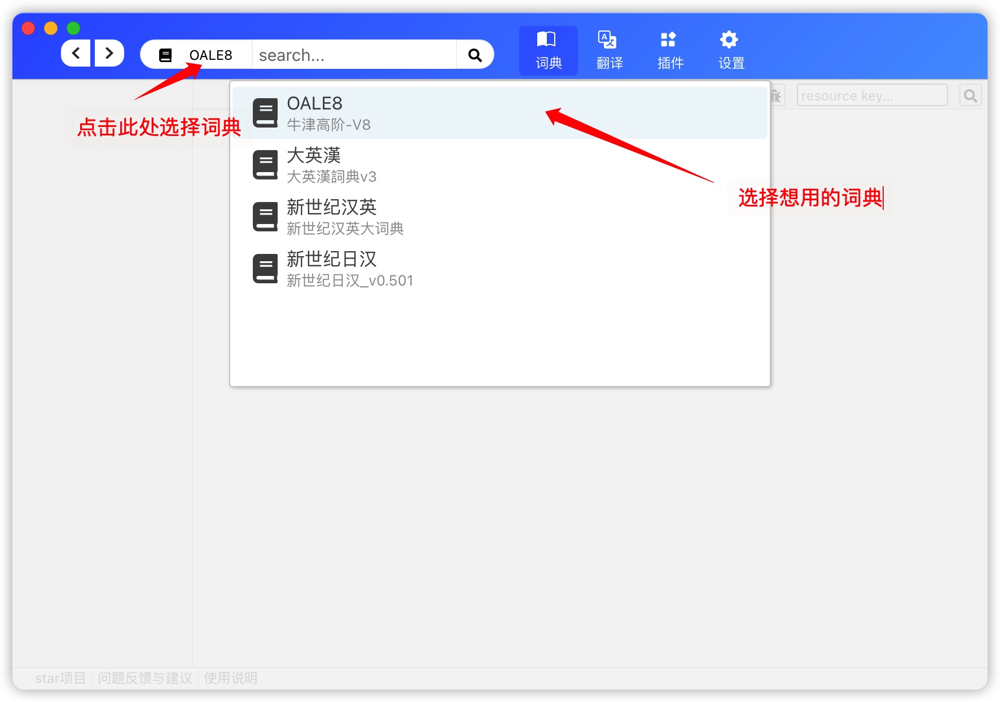

# 词典配置与使用说明

## 步骤1: 添加词典

1. 点击右上角设置
2. 点击下方 "+" 号

3. 在弹出框中填写词典信息
4. 选择词典文件

**注意:** mdx文件所在的文件夹中的js/css/font文件均会被拷贝到缓存文件夹中，请把一个独立词典放在一个独立的文件夹中，并将相关资源放在一起。

**注意:** mdx/mdd 本身不会被拷贝，删除之后，词典将无法找到该mdx文件

## 步骤 2: 查词

1. 选择词典并输入目标词（模糊）

2. 在左边栏选择你想要查的具体词汇, 如果该词汇和其他词汇同一个意思（即@@Link==） 则直接展示该同意义词汇

